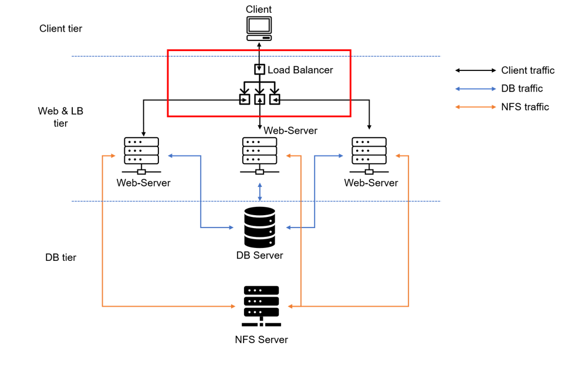
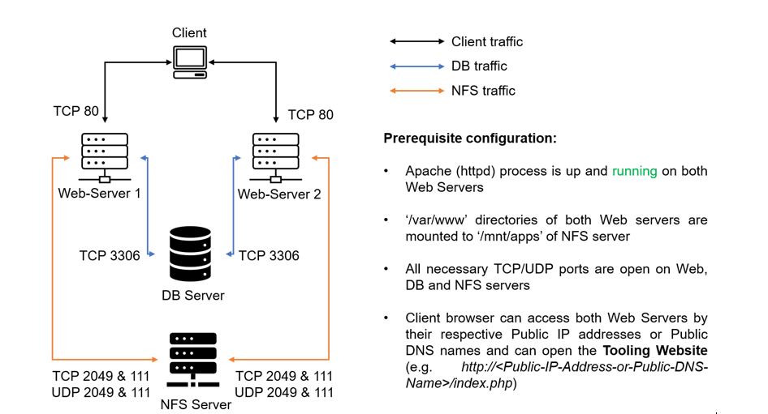

#  Load Balancer Solution with Apache

## Task -- Deploying and configuring Apache Load Balancer for Tooling Website solution on a separate Ubuntu EC2 instance ensuring that users can be served by the Web servers through the Load Balancer

This project introduces the concept of load balancer to the architecture and setup. The load balancer ensures that a single IP address and public DNS name is used to access the website although 3 different web servers were set up.
The load balancer also brings the concept of **Horizontal scaling** which allows adapting to the current load by adding (scale out) or removing (scale in) Web servers.

## Project Architecture

## Project Walk-through

## Setup and Technologies
The solution uses LAMP stack with remote databse and NFS servers and consists of components which includes:
- Infrastructure: AWS
- Linux Webserver: 2 instance of Red Hat Enterprise Linux 8 (RHEL8)
- Database Server: 1 instance of MySQL DB Server (based on Ubuntu 20.04)
- Storage Server:  1 instance of Red Hat Enterprise Linux 8 (RHEL8) NFS Server
- Programming Language: PHP
- Code Repository: GitHub

## Steps

## Configuring Apache as a Load Balancer
