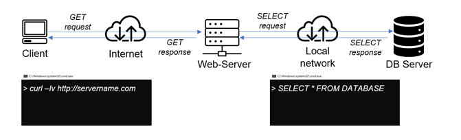

#  Implementating a client server architecture using MySQL database management system

## Task -- Implement a Client-Server Architecture using MySQL Database Management System

To illustrate a basic-client server architecture, follow below steps to set up resources in AWS

### Steps

1. Create and configure 2 Linux-based virtual servers (EC2 instances in AWS)
    * Server A name --> `mysql server`
    * Server B name --> `mysql client`
2. Create 2 Security groups for the EC2 instances defining desired inbound rules from target IPs
3. Installing server version of MySQL on the EC2 instance -- `sudo apt install mysql-server -y`
4. Installing client version of MySQL on the EC2 instance -- `sudo apt install mysql-client -y`
