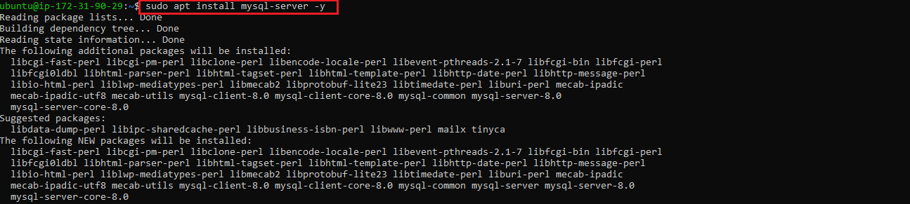
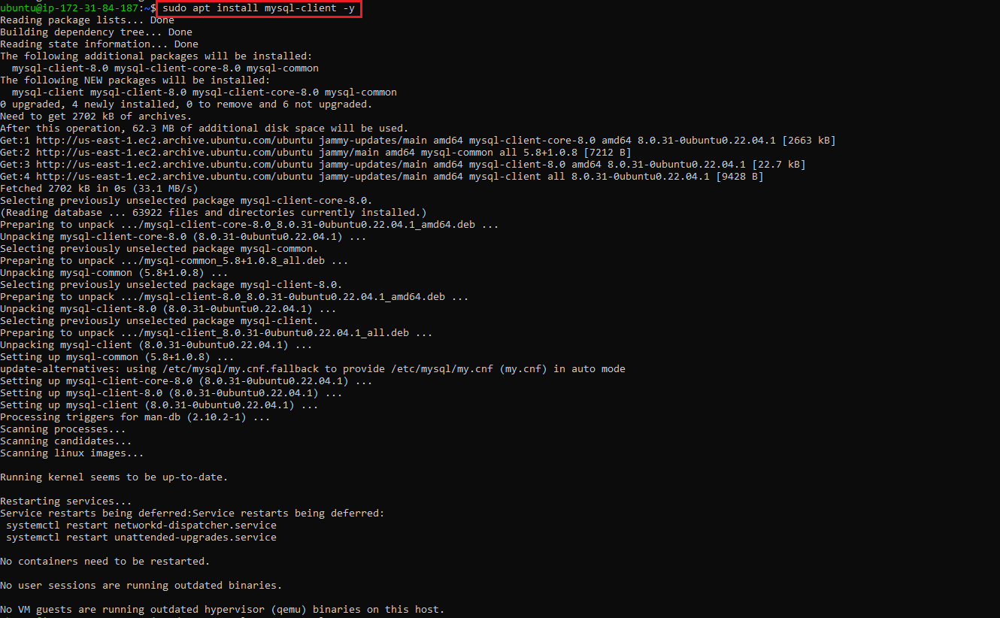

#  Implementating a client server architecture using MySQL database management system

## Task -- Implement a Client-Server Architecture using MySQL Database Management System

To illustrate a basic-client server architecture, follow below steps to set up resources in AWS

### Steps

1. Create and configure 2 Linux-based virtual servers (EC2 instances in AWS)
    * Server A name --> `mysql server`
    * Server B name --> `mysql client`
    

2. Create 2 Security groups for the EC2 instances defining desired inbound rules from target IPs
3. Installing server version of MySQL on the EC2 instance -- `sudo apt install mysql-server -y`
    

4. Enabling the MySQL service on the server after installing -- `sudo systemctl status mysql`
    

5. Installing client version of MySQL on the EC2 instance -- `sudo apt install mysql-client -y`
    

By default, the 2 EC2 instances are located in the same virtual network, thus enabling them communicate with each other using their local IP addresses. Another way to acheive this is by adding the 2 EC2 instances to the same subnet.

To connect to the mysql server from the client server using an IP address, I added a new *inbound rule* in the security group exposing port 3306 defaulty used by TCP as shown below.  
    

6. `sudo mysql` -- To login into the MySQL console.

    Successful login into the MySQL console presents the content below in the terminal.

    
7. `ALTER USER 'root'@'localhost' IDENTIFIED WITH mysql_native_password BY 'PassWord.1';` -- Sets the database root user password to **PassWord.1** 

8. `sudo mysql_secure_installation` -- To set password policy for better database security.

9. Create a user **remote_user** as shown below

    

10. Create a database -**test_db** on the MySQL server as shown below 

    

11. `GRANT ALL ON test_db.* TO 'remote_user'@'%' WITH GRANT OPTION;` -- To grant all privileges to the newly created user - **remote_user** on the *test_db*

12. `sudo systemctl restart mysql` -- To restart mysql server for changes made to take effect.

13. Commenting out **bind-address** in */etc/mysql/mysql.conf.d/mysqld.cnf* as shown below to allow connections from remote hosts into the mysql-server.

    

14. Checking to see if the mysql client Linux Server can connect remotely to mysql server Database Engine without using SSH. You must use the mysql utility to perform this action.

    

15. Showing available databases from client MySQL server as shown below.

    