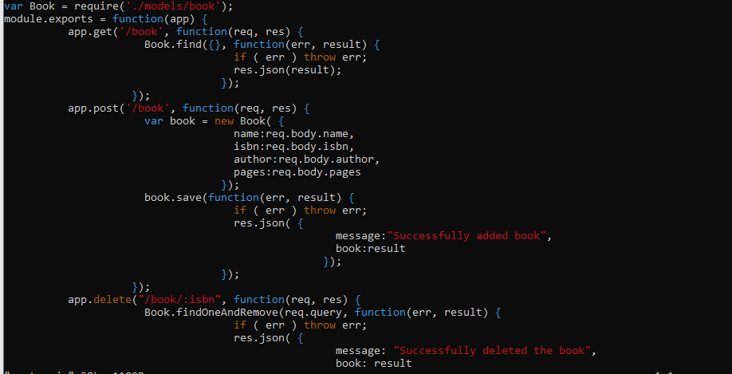

#  Implementation of MEAN (MongoDB-Express-Angular-Node.js) webstack on AWS

### Task- Implement a simple Book Register web form using MEAN stack.

### STEPS

1. Installing Nodejs

    * Provision an Ubuntu Server 20.4 and sign in as an IAM user
    * Connect to the instance through an SSH client
    * Once in terminal, update Ubuntu using command -- `sudo apt update`
    * Next, upgrade Ubuntu using command `sudo apt upgrade`
    * Add certificates -->

        `sudo apt -y install curl dirmngr apt-transport-https lsb-release ca-certificates`
        `curl -sL https://deb.nodesource.com/setup_12.x | sudo -E bash -`
    * Install Nodejs using `sudo apt install -y nodejs`

2. Installing MongoDB

    Adding book record that contains fileds like book name, isbn number, author, and number of pages to MongoDB's JSON-like documents.

    * Running command `sudo apt install -y mongodb` to install MongoDB
    * Starting the server by running command -- `sudo service mongodb start`
    * Verifying that servicer is up and running -- `sudo systemctl status mongodb`
    * Installing Node packet management -- `sudo apt install -y npm`
    * Installing body-parser package to help process JSON files -- `sudo npm install body-parser`
    * Creating folders **Books** and cd-ing into the **Books** folder -- `mkdir Books && cd Books`
    * Initializing the npm project -- `npm init`
    * Creating a server.js file and populating as shown below -- `touch server.js && vi server.js`
        

3. Installing Express and setting up routes to server

    Express is a minimal and flexible Node.js web application framework that provides features for web and mobile applications. We will use Express to pass book information to and from our MongoDB database.

    I also installed [Mongoose](https://mongoosejs.com/) to establish a schema for the database to store data of our book register

    * Installing [Mongoose](https://mongoosejs.com/) using command -- `sudo npm install express mongoose`
    * Creating a folder for the Books registry -- `mkdir apps && cd apps`
    * Creating file for routing and populating with code as shown below --  `touch routes.js && vi routes.js`
    

    * Creating a folder for the models and populating a model file with code as shown below --  `mkdir models && cd models`
    * Creating file books.js and populating with code as seen below -- `vi book.js`
    

4. Accessing routes with AngularJS

    Express is a minimal and flexible Node.js web application framework that provides features for web and mobile applications. We will use Express to pass book information to and from our MongoDB database.

    *  Creating a folder named public and populating a created file with code as shown below --  `mkdir public && cd public`

    

    * In the public folder, I created a file named index.html and populated with code to be rendered in the frontend

5. Testing setup and verifying workability

    * Start server by running -- `node server.js` 
    * Since server is running on port 3300 -- Created an inbound rule in the security group for port 3300
    * Accessing the WebBook Register Application in the browser
    
