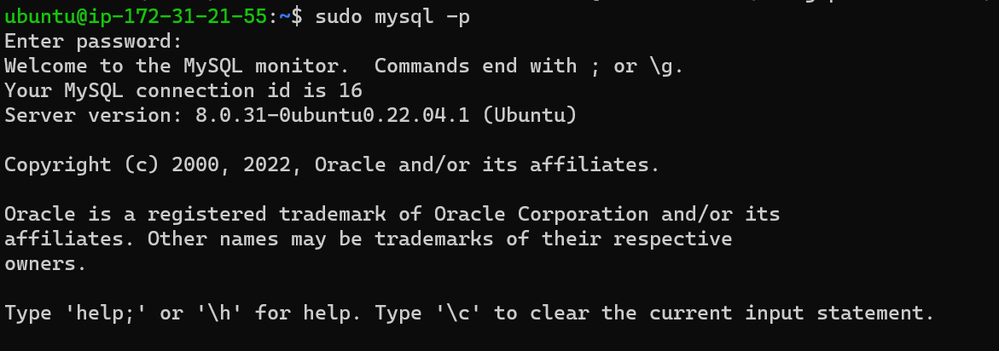

#  Implementation of LAMP (Linux-Apache-MySQL-PhP) webstack on AWS

## AWS account set up and provisioning Ubuntu Server

### Steps

1. Create an AWS account
2. Sign in as an IAM user
3. Create a Security group for the EC2 instance defining desired inbound rules from target IPs
     
4. Launched EC2 instance, selecting an Ubuntu free tier
5. Made necessary configurations (Enabling Public IP, Assigning security group created in 3, creating key)-value pair) needed to run the EC2 instance.
    
6. SSH-ed into the EC2 instance using the windows terminal
    - Downloaded the Windows SSH from the windows store
    - Followed steps in [ARTICLE](https://learn.microsoft.com/en-us/windows-server/administration/openssh/openssh_install_firstuse?source=recommendations&tabs=powershell) in installing and configuring OpenSSH in windows.
    - The openSSH allows remote access into our EC2 instance from the windows terminal.
    - Followed steps in [OpenSSH key management](https://learn.microsoft.com/en-us/windows-server/administration/openssh/openssh_keymanagement) to create key authentication management for OpenSSH in windows
    

## Installing Apache and Updating Firewall

### Steps

1. `sudo apt update` -- Updating packages in the package manager

2. `sudo apt install apache2` -- Installing Apache2

3. `sudo systemctl status apache2` -- Verifying the status of Apache2

    

    - Check to see if installed Apache is accessible on Ubuntu server
    - To do so, run `curl -s http://169.254.169.254/latest/meta-data/public-ipv4` to get the IP address of the device
    - Entering [Checking Apache HTTP server response to requests from the internet](http://<Public-IP-Address>:80) replacing <Public-IP-Address> with the IP address gotten from above step presents a webpage rendered with the information below.
    - 
    

## Installing MySQL Database
With the Apache server up and running, there is a need to set up a MySQL database for storing and managing relational data for the dynamic website.

### Steps

1. `sudo apt install mysql-server` -- Installing MySQL server on the EC2 instance

2. `sudo mysql` -- To login into the MySQL console.

    Successful login into the MySQL console presents the content below in the terminal.

    
3. `ALTER USER 'root'@'localhost' IDENTIFIED WITH mysql_native_password BY 'PassWord.1';` -- Sets the database root user password to **PassWord.1** 

4. `sudo mysql_secure_installation` -- To set password policy for better database security.

## Installing PhP
With the Apache setup to serve content and MySQL setup for storing and managing data. There is a need for PhP to process code and display dynamic content to the end user.

### Steps

1. `sudo apt install php libapache2-mod-php php-mysql` -- Instals **php-mysql**; a PhP module that allows PHP communicate with MySQL-based databases and **libapache2-mod-php** that enables Apache handle PHP files.

2. `php -v` -- Confirms the version of php installed on machine by displaying console information shown below

    

## Creating virtual host for website using Apache
With virtual host, multiple websites can be hosted on a single machine without being known to users of those websites.

### Steps

1. `sudo mkdir /var/www/projectlamp` -- Setting up a new domain called **projectlamp** by creating a directory named *projectlamp* in */var/www/*

2. `sudo chown -R $USER:$USER /var/www/projectlamp` -- Changes ownership of the directory created in **1** so that the current user assumes ownership

3. `sudo vi /etc/apache2/sites-available/projectlamp.conf` -- Creates and open a new configuration file in Apache's *sites-available*

    

This Virtual host configuration serves projectlamp using **/var/www/projectlampl** as its web root directory

`sudo a2ensite projectlamp` -- Enables the new virtual host

`sudo a2dissite 000-default` -- To disable Apache's default website from loading up 

`sudo apache2ctl configtest` -- Run command to ensure that configuration file does not contain syntax error

`sudo systemctl reload apache2` -- Reloads Apache so changes take effect

The *projectlamp* currently does not have content to render.
Run `sudo echo 'Hello LAMP from hostname' $(curl -s http://169.254.169.254/latest/meta-data/public-hostname) 'with public IP' $(curl -s http://169.254.169.254/latest/meta-data/public-ipv4) > /var/www/projectlamp/index.html` to redirect message *HELLO LAMP from hostname - <hostname> with public IP <IP_Address>* to an index.html file created in **/var/www/projectlamp/index.html**

To view content in browser, put in `http://<Public-IP-Address>:80` in address bar of your browser.

## Enabling PhP on the website
By default, the Directory index settings sets *index.html* superior to *index.php*, to change this behavior and make *index.php* the homepage instead of *index.html*, I edited the */etc/apache2/mods-enabled/dir.conf* file and changed the list order of the DirectoryIndex.

### Steps

1. `sudo vim /etc/apache2/mods-enabled/dir.conf` -- Launches the configuration file in the vim editor

2. The goal is to change the order of the directory index as shown in screenshot below

    

3. Testing the PhP website in thr browser shows

    

4. `sudo rm /var/www/projectlamp/index.php` -- Removing the *index.php* file due to sensitivity of information in there.
