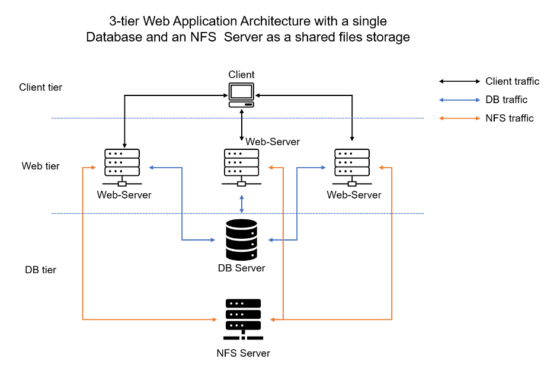

#  DevOps Tooling Website Solution

## Task -- Implementing a single tooling solution for DevOps that consists of:
* Jenkins --  [Jenkins](https://www.jenkins.io/) – Free and open source automation server used to build [CI/CD](https://en.wikipedia.org/wiki/CI/CD) pipelines.
* [Kubernetes](https://kubernetes.io/) – an open-source container-orchestration system for automating computer application deployment, scaling, and management.
* [Jfrog Artifactory](https://jfrog.com/artifactory/) – Universal Repository Manager supporting all major packaging formats, build tools and CI servers. Artifactory.
* [Rancher](https://rancher.com/products/rancher/) – an open-source software platform that enables organizations to run and manage [Docker](https://en.wikipedia.org/wiki/Docker_(software)) and Kubernetes in production.
* [Grafana](https://grafana.com/) – a multi-platform open-source analytics and interactive visualization web application.
* [Prometheus](https://prometheus.io/) – An open-source monitoring system with a dimensional data model, flexible query language, efficient time series database and modern alerting approach.
* [Kibana](https://www.elastic.co/kibana) – Kibana is a free and open user interface that lets you visualize your [Elasticsearch](https://www.elastic.co/elasticsearch/) data and navigate the [Elastic Stack](https://www.elastic.co/elastic-stack).

## Project Architecture

## Setup and Technologies
The solution uses LAMP stack with remote databse and NFS servers and consists of components which includes:
- Infrastructure: AWS
- Linux Webserver: Red Hat Enterprise Linux 8
- Database Server: Ubuntu 20.04 + MySQL
- Storage Server:  Red Hat Enterprise Linux 8 + NFS Server
- Programming Language: PHP
- Code Repository: GitHub

## Steps

## Creating an EC2 instance and configuring storage volumes

- Spining up an EC2 instance with RHEL Linux 8 Operating System and attaching 3 EBS volumes to the server 
- Created single patitions on EBS volumes attached to EC2 instance
- Installed lvm2 package so as to be able to check for available partitions
- Marked each attached EBS volume as physical volumes using the **pvcreate** command
- Using the **vgcreate** command to add all physical volume to a volume group
- Creating 3 logical volumes and their mounting points
    * **lv-apps** to be mounted on **/mnt/apps** to store data for the database.
    * **lv-logs** to be mounted on **/mnt/logs** to store data for logs.
    * **lv-opt** to be mounted on **/mnt/opt** to be later used by Jenkins server.
- Verify entire setup using -- sudo lsblk
    
- Formatting the logical volumes with **xfs** filesystem using -- **mkfs.xfs** command
- Install NFS server and configuring to ensure persistence (configure to start at boot time)
    * `sudo yum -y update`
    * `sudo yum install nfs-utils -y`
    * `sudo systemctl start nfs-server.service`
    * `sudo systemctl enable nfs-server.service`
    * `sudo systemctl status nfs-server.service`

- Exporting mounts for webservers’ subnet CIDR to connect as clients. That is, installing all three Web Servers inside the same subnet.
    * Checking the EC2's subnet CIDR by opening the EC2 details in the AWS web console and locating the ‘Networking’ tab for the Subnet link as seen
    

    * Setting up permissions that allows Web servers to read, write and execute files on NFS
        * Changing ownership of webservers to nobody
        `sudo chown -R nobody: /mnt/apps`
        `sudo chown -R nobody: /mnt/logs`
        `sudo chown -R nobody: /mnt/opt`

        * Granting full read-write-execute permissions for all category of users on server
        `sudo chmod -R 777 /mnt/apps`
        `sudo chmod -R 777 /mnt/logs`
        `sudo chmod -R 777 /mnt/opt`

        * Restarting service to ensure effect changes made to server
        `sudo systemctl restart nfs-server.service`
    
    * Configuring access to NFS server for clients within the same subnet as shown below:
    

    * Checking the port used by NFS and opening by adding new Inbound Rule in Security Groups
    `rpcinfo -p | grep nfs`

    * Opening ports TCP 111, UDP 111 and UDP 2049 in order for NFS server to be accessible from client as shown below:
     

## Configuring the database server

1. Installing MySQL server on the EC2 instance -- `sudo yum install mysql-server`

2. To login into the MySQL console -- `sudo mysql`

3. Creating a database **tooling** on the MySQL server as shown below 
    

4. Creating database user named **webaccess** -- `create user 'webaccess'@'172.31.80.0/20' identified by 'password';`

5. Granting permission to **webaccess** user on **tooling** database to do anything only from the webservers' subnet CIDR -- `grant all privileges on tooling.* to 'webaccess'@'172.31.80.0/20';`

## Configuring the web servers

This configuration ensures the Web Servers can serve the same content from shared storage solutions – NFS Server and MySQL database

For storing shared files that our Web Servers will use – I utilized the NFS and mount previously created Logical Volume **lv-apps** to the folder where Apache stores files to be served to the users **(/var/www)**

* Launched a new EC2 instance with RHEL 8 Operating System
* Installing the NFS client -- `sudo yum install nfs-utils nfs4-acl-tools -y`
* Mounting **/var/www/** and targeting the NFS server’s export for **apps**
    `sudo mkdir /var/www`
    `sudo mount -t nfs -o rw,nosuid <NFS-Server-Private-IP-Address>:/mnt/apps /var/www`

* Verifying that the NFS was mounted successfully by running `df -h` 
* Ensuring that the changes persisted on Web Server after reboot by editing the **/etc/fstab** file as shown below

    `sudo vi /etc/fstab`
    

* Installing [Remi's repository](http://www.servermom.org/how-to-enable-remi-repo-on-centos-7-6-and-5/2790/), Apache and PHP

    * `sudo yum install httpd -y`
    * `sudo dnf install https://dl.fedoraproject.org/pub/epel/epel-release-latest-8.noarch.rpm`
    * `sudo dnf install dnf-utils http://rpms.remirepo.net/enterprise/remi-release-8.rpm`
    * `sudo dnf module reset php`
    * `sudo dnf module enable php:remi-7.4`
    * `sudo dnf install php php-opcache php-gd php-curl php-mysqlnd`
    * `sudo systemctl start php-fpm`
    * `sudo systemctl enable php-fpm`
    * `setsebool -P httpd_execmem 1`

Repeating the steps above for 2 other EC2 instances

- Verifying that Apache files and directories are available on the Web Server in **/var/www** and also on the NFS server in **/mnt/apps**. Seeing same files means NFS is mounted correctly. Created a new file **touch test.txt** from one server and check if the same file is accessible from other Web Servers.

- Locating the log folder for Apache on the Web Server and mount it to NFS server’s export for log
    * Ensure that the mount point persists after reboot.

- Open the TCP port 80 on the Web Server 

- If Error 403 pops, check permissions to **/var/www/html** folder and disable SELinux by using command `sudo setenforce 0`

- To make change permanent –- open config file `sudo vi /etc/sysconfig/selinux` 
    * Set SELINUX=disabled
    * Restart httpd -- `sudo systemctl restart httpd`

- Update the website’s configuration to connect to the database **in /var/www/html/functions.php file** by applying the **tooling-db.sql** script to the database using -- `mysql -h <databse-private-ip> -u <db-username> -p <db-pasword> <tooling-db.sql>`

- Create in MySQL a new admin user with username: **myuser** and password: **password**

- Registering user in the database.
    `INSERT INTO ‘users’ (‘id’, ‘username’, ‘password’, ’email’, ‘user_type’, ‘status’) VALUES -> (1, ‘myuser’, ‘5f4dcc3b5aa765d61d8327deb882cf99’, ‘user@mail.com’, ‘admin’, ‘1’);`

- Checking to see if website works by opening 
**http://<Web-Server-Public-IP-Address-or-Public-DNS-Name>/index.php** in the browser and making sure user - **myuser** can login to the website.