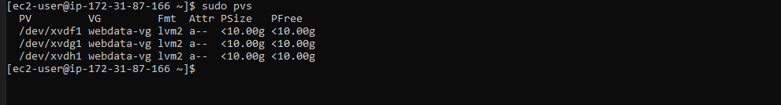
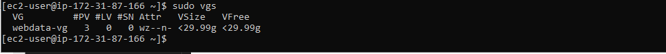
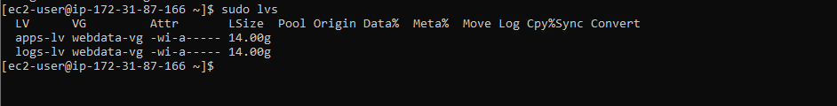
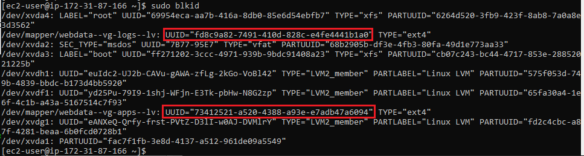
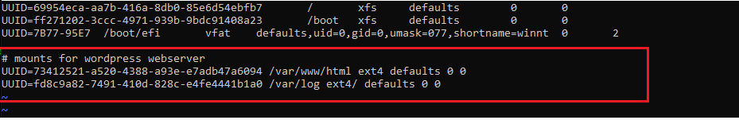
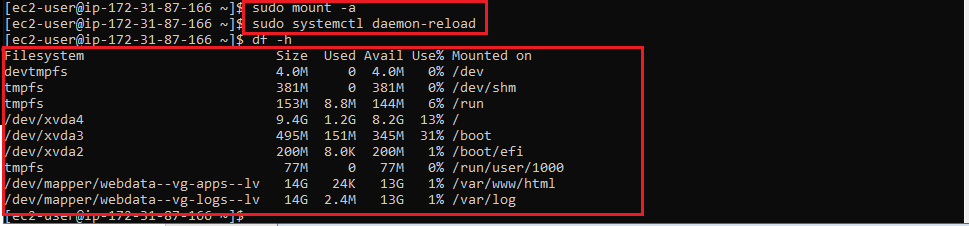

#  Implementing web solution with Wordpress on a tier-3 architecture consisting of 3 different system instance to make up the 3 separate layers

## Task -- Implement a Client-Server Architecture using MySQL Database Management System that comprises of 3 separate layers namely:

- A Laptop or PC to serve as a client
- A CentOS EC2 Linux Server as a web server (This is where you will install WordPress)
- An CentOS EC2 Linux server as a database (DB) server

### Steps

1. Launching an EC2 instance to serve as the **Web Server** and creating 3 EBS volumes each of 10 GiB.

    

2. Configuring the added EBS volumes in the Linux terminal

    

3. Creating single partitions on each of the attached EBS volume using the **gdisk** command. See partitions created below.

    

4. Installing the logical volume package using `sudo yum install lvm2`

5. Checking for available disk partitions using -- `lvmdiskscan`

6. Uisng `pvcreate` to mark each of 3 EBS volumes attached as physical volumes (PVs) to be used by LVM

7. Adding EBS volumes to same volume groups using the *vgcreate** command as in -- `sudo vgcreate webdata-vg /dev/xvdh1 /dev/xvdg1 /dev/xvdf1`

8. Verifying physical volume group has been created using `sudo pvs` as seen below

    

8. Verifying volume group has been created using `sudo vgs` as seen below

    

9. Creating 2 logical volumes
    - `sudo lvcreate -n apps-lv -L 14G webdata-vg` -- **apps-lv** to store data for the Website
    - `sudo lvcreate -n logs-lv -L 14G webdata-vg` -- **logs-lv** store data for logs

10. Verifying logical volume group has been created using `sudo lvs` as seen below

    

11. Viewing the entire storage setup using -- `sudo vgdisplay -v #view complete setup - VG, PV, and LV`

    

12. Formatting the 2 logical volumes with [ext4](https://en.wikipedia.org/wiki/Ext4) filesystem
    - `sudo mkfs -t ext4 /dev/webdata-vg/apps-lv` -- Formatting storage that stores data for the Website 
    - `sudo mkfs -t ext4 /dev/webdata-vg/logs-lv` -- Formatting storage that stores data for logs

13. Creating directories to store website files in */var/www/html* -- `sudo mkdir -p /var/www/html`

14. Creating directories to store backup of log files in */home/recovery/logs* -- `sudo mkdir -p /home/recovery/logs`

15. Mounting the */var/www/html* directory on the *aps-lv* logical volume using -- `sudo mount /dev/webdata-vg/apps-lv /var/www/html/`

16. Backing up all the files in the log directory /var/log into log directory created in */home/recovery/logs* using the **rsync** command -- `sudo rsync -av /var/log/. /home/recovery/logs/`

17. Mounting directory */var/log* on the *logs-lv* logical volume using -- `sudo mount /dev/webdata-vg/logs-lv /var/log`

18. Restoring log files back into */var/log* directory using -- `sudo rsync -av /home/recovery/logs/. /var/log`

## Ensuring the mount configuration stays persistent after device restart

1. Registering the UUID of devices in the */etc/fstab* file by getting the UUID of devices using -- `sudo blkid` as shown below
    

2. Registering the UUIDs of devices in */etc/fstab* by running -- `sudo vi /etc/fstab`
    

3. Testing configuration by reloading daemon using -- 
    `sudo mount -a`
    `sudo systemctl daemon-reload`

    

## Creating a new EC2 instance and performing above process as in Webserver

- Created single patitions on EBS volumes attached to EC2 instance
- Installed lvm2 package so as to be able to check for available partitions
- Marked each attached EBS volume as physical volumes using the **pvcreate** command
- Using the **vgcreate** command to add all physical volume to a volume group
- 

