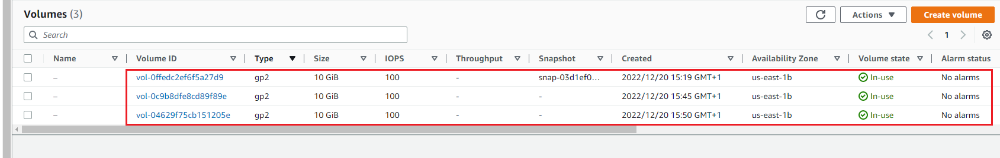
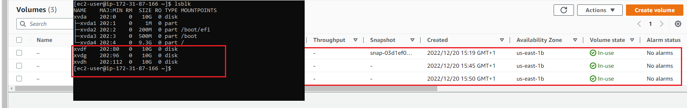

#  Implementing web solution with Wordpress on a tier-3 architecture consisting of 3 different system instance to make up the 3 separate layers

## Task -- Implement a Client-Server Architecture using MySQL Database Management System that comprises of 3 separate layers namely:

- A Laptop or PC to serve as a client
- An EC2 Linux Server as a web server (This is where you will install WordPress)
- An EC2 Linux server as a database (DB) server

### Steps

1. Launching an EC2 instance to serve as the **Web Server** and creating 3 EBS volumes each of 10 GiB.

    

2. Configuring the added EBS volumes in the Linux terminal

    

3. Creating single partitions on each of the attached EBS volume using the **gdisk** command

