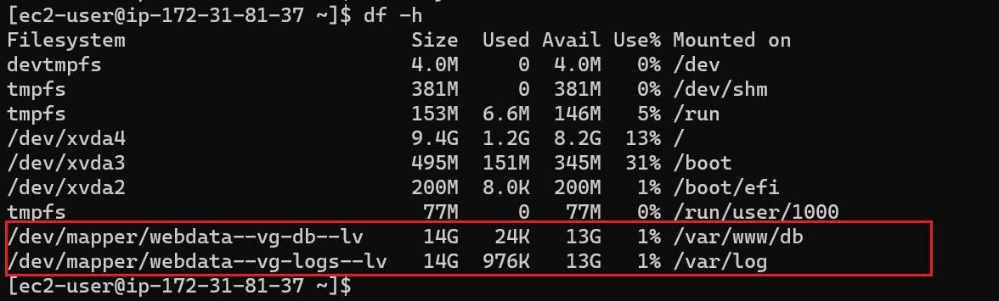

#  Implementing web solution with Wordpress on a tier-3 architecture consisting of 3 different system instance to make up the 3 separate layers

## Task -- Implement a Client-Server Architecture using MySQL Database Management System that comprises of 3 separate layers namely:

- A Laptop or PC to serve as a client
- A CentOS EC2 Linux Server as a web server (This is where you will install WordPress)
- An CentOS EC2 Linux server as a database (DB) server

### Steps

1. Launching an EC2 instance to serve as the **Web Server** and creating 3 EBS volumes each of 10 GiB.

    

2. Configuring the added EBS volumes in the Linux terminal

    

3. Creating single partitions on each of the attached EBS volume using the **gdisk** command. See partitions created below.

    

4. Installing the logical volume package using `sudo yum install lvm2`

5. Checking for available disk partitions using -- `lvmdiskscan`

6. Using `pvcreate` to mark each of 3 EBS volumes attached as physical volumes (PVs) to be used by LVM
    - `sudo pvcreate /dev/xvdf1`
    - `sudo pvcreate /dev/xvdg1`
    - `sudo pvcreate /dev/xvdh1`

7. Adding EBS volumes to same volume groups using the *vgcreate** command as in -- `sudo vgcreate webdata-vg /dev/xvdh1 /dev/xvdg1 /dev/xvdf1`

8. Verifying physical volume group has been created using `sudo pvs` as seen below

    

8. Verifying volume group has been created using `sudo vgs` as seen below

    

9. Creating 2 logical volumes
    - `sudo lvcreate -n apps-lv -L 14G webdata-vg` -- **apps-lv** to store data for the Website
    - `sudo lvcreate -n logs-lv -L 14G webdata-vg` -- **logs-lv** store data for logs

10. Verifying logical volume group has been created using `sudo lvs` as seen below

    

11. Viewing the entire storage setup using -- `sudo blkid`

    

12. Formatting the 2 logical volumes with [ext4](https://en.wikipedia.org/wiki/Ext4) filesystem
    - `sudo mkfs -t ext4 /dev/webdata-vg/apps-lv` -- Formatting storage that stores data for the Website 
    - `sudo mkfs -t ext4 /dev/webdata-vg/logs-lv` -- Formatting storage that stores data for logs

13. Creating directories to store website files in */var/www/html* -- `sudo mkdir -p /var/www/html`

14. Creating directories to store backup of log files in */home/recovery/logs* -- `sudo mkdir -p /home/recovery/logs`

15. Mounting the */var/www/html* directory on the *aps-lv* logical volume using -- `sudo mount /dev/webdata-vg/apps-lv /var/www/html/`

16. Backing up all the files in the log directory /var/log into log directory created in */home/recovery/logs* using the **rsync** command -- `sudo rsync -av /var/log/. /home/recovery/logs/`

17. Mounting directory */var/log* on the *logs-lv* logical volume using -- `sudo mount /dev/webdata-vg/logs-lv /var/log`

18. Restoring log files back into */var/log* directory using -- `sudo rsync -av /home/recovery/logs/. /var/log`

## Ensuring the mount configuration stays persistent after device restart

1. Registering the UUID of devices in the */etc/fstab* file by getting the UUID of devices using -- `sudo blkid` as shown below
    

2. Registering the UUIDs of devices in */etc/fstab* by running -- `sudo vi /etc/fstab`
    

3. Testing configuration by reloading daemon using -- 
    * `sudo mount -a`
    * `sudo systemctl daemon-reload`

4. Verifying setup by runnign command -- `df -h`
    

## Creating a new EC2 instance and performing above process as in Webserver

- Created single patitions on EBS volumes attached to EC2 instance
- Installed lvm2 package so as to be able to check for available partitions
- Marked each attached EBS volume as physical volumes using the **pvcreate** command
- Using the **vgcreate** command to add all physical volume to a volume group
- Creating 2 logical volumes with
    * db-lv -- to store data for the database.
    * logs-lv -- to store data for logs.
- Verify entire setup using -- sudo lsblk
    
- Formatting both logical volumes with ext4 filesystem using -- **mkfs.ext4** command
- Creating **var/www/db** directory to store database files
- Creating **home/recovery/logs** directory to store backupof log files
- Mounting the **var/www/db** on db-lv logical volume
- Backing up **var/log** on the **/home/recovery/logs** directory using **rsync** command
- Mounting **var/log** on logs-lv logical volume
- Restoring log files back to the **var/log** directory using the **rsync** command
- Updating the **/etc/fstab** file with the UUIDs of the logical volumes to ensure persistence when the device restarts.
- Testing configuration by reloading daemon using
    `sudo mount -a`
    `sudo systemctl daemon-reload`

    

## Installing WordPress on EC2 Webserver

1. Updating the package repository

2. Installing wget, Apache and its dependencies
    `sudo yum -y install wget httpd php php-mysqlnd php-fpm php-json`

3. Starting Apache
    * `sudo systemctl enable httpd`
    * `sudo systemctl start httpd`

4. Installing PHP and its dependencies
    * `sudo yum install https://dl.fedoraproject.org/pub/epel/epel-release-latest-8.noarch.rpm`
    * `sudo yum install yum-utils http://rpms.remirepo.net/enterprise/remi-release-8.rpm`
    * `sudo yum module list php`
    * `sudo yum module reset php`
    * `sudo yum module enable php:remi-7.4`
    * `sudo yum install php php-opcache php-gd php-curl php-mysqlnd`
    * `sudo systemctl start php-fpm`
    * `sudo systemctl enable php-fpm`
    * `setsebool -P httpd_execmem 1`

5. Restarting Apache -- `sudo systemctl restart httpd`

6. Downloading WordPress and copying wprdpress to **var/www/html** by running the following commands
    * `mkdir wordpress`
    * `cd   wordpress`
    * `sudo wget http://wordpress.org/latest.tar.gz`
    * `sudo tar xzvf latest.tar.gz`
    * `sudo rm -rf latest.tar.gz`
    * `cp wordpress/wp-config-sample.php wordpress/wp-config.php`
    * `cp -R wordpress /var/www/html/`

7. Configuring SELinux policies by running the following commands
    * `sudo chown -R apache:apache /var/www/html/wordpress`
    * `sudo chcon -t httpd_sys_rw_content_t /var/www/html/wordpress -R`
    * `sudo setsebool -P httpd_can_network_connect=1`
    * `sudo setsebool -P httpd_can_network_connect_db 1`

## Installing MySQL on EC2 DB Server
- Updating the package manager on EC2 DB server using -- `sudo yum update`
- Installing mysql server using -- `sudo yum install mysql-server`
- Verifying that service is running using -- `sudo systemctl status mysqld`
- Configuring DB to work with wordpress and creating DB user as shown below
    

## Configuring WordPress to connect to the remote database
- Opening MySQL port 3306 on DB Server EC2, allowing access to the DB server ONLY from your Web Server’s IP address.
    

- Installing MySQL client and testing connection from your Web Server to your DB server by using mysql-client
    

    

