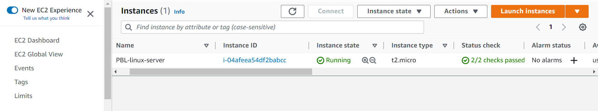
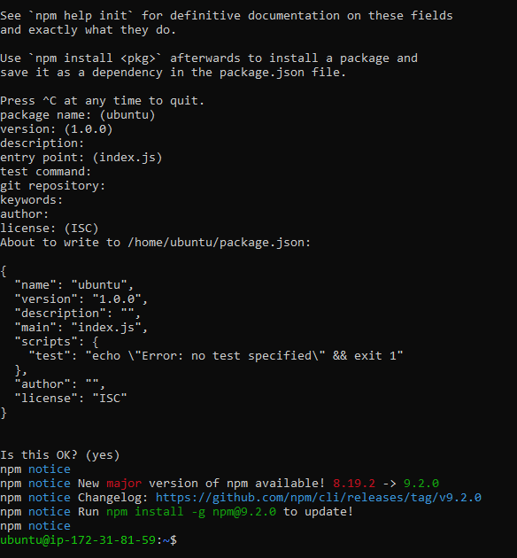

#  Implementation of simple TO-DO Application on MERN (MongoDB-ExpressJS-ReactJS-NodeJS) webstack in AWS

## AWS account set up and provisioning Ubuntu Server

### Steps

1. Create a Security group for the EC2 instance defining desired inbound rules from target IPs
     

2. Launched EC2 instance, selecting an Ubuntu free tier

3. Made necessary configurations (Enabling Public IP, Assigning security group created in 2, creating key)-value pair) needed to run the EC2 instance.
    

4. SSH-ed into the EC2 instance using the windows terminal
    - Downloaded the Windows SSH from the windows store
    - Followed steps in [ARTICLE](https://learn.microsoft.com/en-us/windows-server/administration/openssh/openssh_install_firstuse?source=recommendations&tabs=powershell) in installing and configuring OpenSSH in windows.
    - The openSSH allows remote access into our EC2 instance from the windows terminal.
    - Followed steps in [OpenSSH key management](https://learn.microsoft.com/en-us/windows-server/administration/openssh/openssh_keymanagement) to create key authentication management for OpenSSH in windows
    

5. `sudo apt update` -- Updating packages in the package manager

## Installing Node and NPM on Ubuntu Server

### Steps

1. `curl -fsSL https://deb.nodesource.com/setup_18.x | sudo -E bash -` -- Getting location of Node.js software from [Ubuntu repository](https://github.com/nodesource/distributions#deb)

2. `sudo apt-get install -y nodejs` -- Installing Node.js and [Node package manager (NPM)](https://www.npmjs.com/)

3. `node -v` -- Verifying node installation

4. `npm -v` -- Verifying npm installation

5. `mkdir` -- Creating project directory

6. `npm init` -- Initializing project directory to create *package.json*

    

## Installing ExpressJS on Ubuntu Server

### Steps

1. `npm install express` -- Installing express using npm

2. `touch index.js` -- Creating an *index.js* file

3. `npm install dotenv` -- Installing dotenv module

4. `vim index.js` -- Populating the *index.js* file, specifying port **5000** as shown below

    

5. `node index.js` -- Starting server to see if it is running on port 5000

6. *http://3.86.238.24:5000/* -- Accessing the server's public IP address followed by port 5000 in the browser results in webpage displayed like so:

    

The Todo application will utilize the standard [HTTP requests methods](https://developer.mozilla.org/en-US/docs/Web/HTTP/Methods) to perform: 
    - Create a new task
    - Display list of all tasks
    - Delete a completred task

To perform each of these tasks, I created routes that will define the various endpoints that these To-do tasks will depend on

- `mkdir routes` -- Creating folder **routes** for to define endpoints for the application's tasks.

- `cd routes` -- Chnaging directory to the *routes* folder

- `touch api.js` -- Creating an **api.js** file

- `vim api.js` -- Opening the **api.js** file and populating using the **vi** editor like so:

    

    

## Installing [MongoDB](https://www.mongodb.com/) on the Ubuntu Server and creating a NoSQL database

This procedure allows the creation of models to define the database schema -- blueprint of how the database will be constructed, including other data fields that may not be required to be stored in the database

### Steps

1. `npm install mongoose` -- I installed [mongoose](https://mongoosejs.com/) using NPM for schema and model creation

2. `mkdir models && cd models && touch todo.js` -- Creating a models folder and creating a *todo.js* file inside the **models** folder

3.  `vim todo.js` -- Opening the **todo.js** file and populating using the **vi** editor like so:

    

4. `vim api.js` -- I updated the routes in the *api.js* file to make use of the new model like so

    

## Setting up the MongoDB database

In this procedure I utlized mLab -- A platform that provides database as a service solution. [DBaaS](https://en.wikipedia.org/wiki/Cloud_database)

### Steps

1. I signed up and created an account on [mLab](https://www.mongodb.com/atlas-signup-from-mlab)

2. Created a database and allowed acces to the database from anywhere as shown below

    

3. Created a database user and retrieved a connection string to access the database as shown below

    

4. To effect the *process.env* declared to access environment variables in *index.js* file, I created a *.env* file in the **Todo** directory and added the connection string as shown below.

    

5. Updating the index.js file to reflect the use of the environment variables in the newly created *.env* file as shown below

    

6. `node index.js` -- Testing the database connection 

    

## Testing Backend configuration using Postman

In absence of a frontend UI to test the functionality of the backend, I installed [Postman](https://www.getpostman.com/) to test all API endpoints

### Steps

1. I created a POST request to the API *http://<PublicIP-or-PublicDNS>:5000/api/todos* which sends a new task request to the To-Do list so the application could store it in the database. I ensured to set header key Content-Type as application/json as shown below

    

    

2. I created a GET request to the API *http://<PublicIP-or-PublicDNS>:5000/api/todos* which retrieves all existing records from out To-do application. Backend requests these records from the database and sends it us back as a response to GET request) as shown below.

    

## Creating user interface to faciliatate interaction between the Todo application and browser via API

### Steps

- ` npx create-react-app client` -- Creates a directory called *client* in the same **Todo** directory where *react* code will be added

### Installing react dependencies
- `npm install concurrently --save-dev` -- [Concurrently](https://www.npmjs.com/package/concurrently) is used to run more than one command simultaneously from the same terminal window

- `npm install nodemon --save-dev` -- [nodemon](https://www.npmjs.com/package/nodemon) is used to run and monitor the server. If there is any change in the server code, nodemon will restart it automatically and load the new changes

- Updating the script dict in the package.json file in the Todo folder with the command below

        "scripts": {
        "start": "node index.js",
        "start-watch": "nodemon index.js",
        "dev": "concurrently \"npm run start-watch\" \"cd client && npm start\""},

- I configured proxy in the *package.json* file in the **client** directory and added the *"proxy": "http://localhost:5000"* to access the application from the browser by calling the server url like *http://localhost:5000* rather than always including the entire path like *http://localhost:5000/api/todos*

- Created a new security group on running EC2 instance exposing port 3000

- `npm run dev` -- To check the port where application is running

### Creating react components

The Todo application makes use of stateless and stateful components

### Steps

- `mkdir components && touch Input.js ListTodo.js Todo.js` -- Creating files for the components in the components directory.

