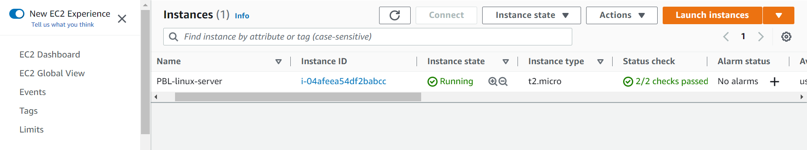
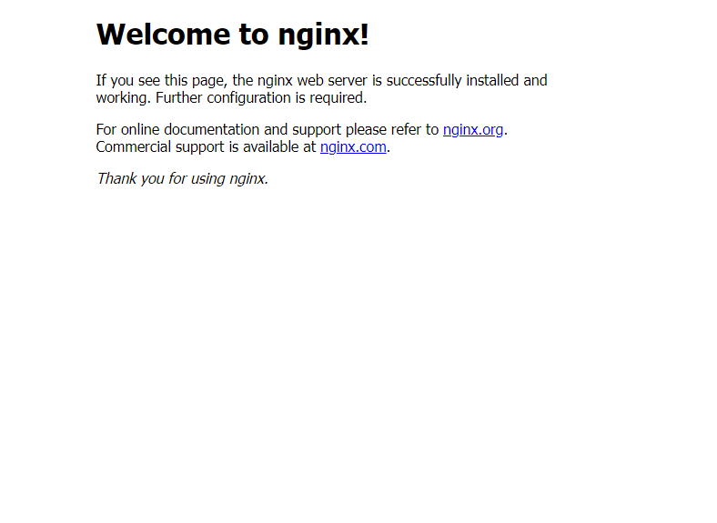
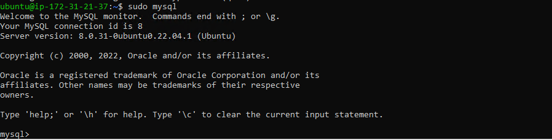
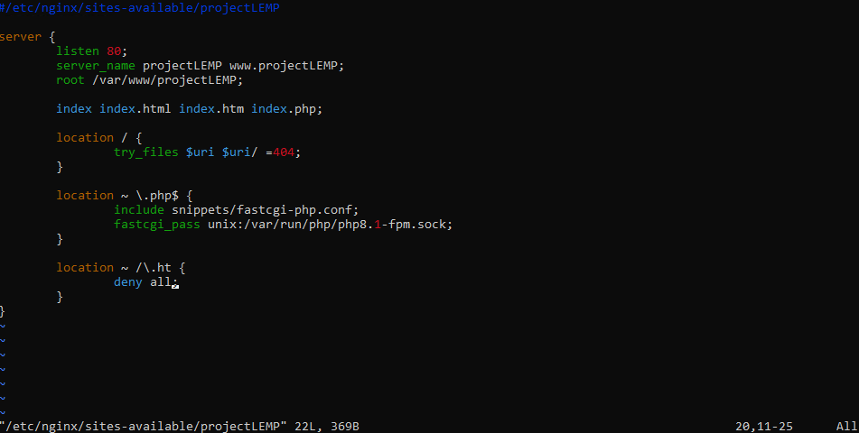
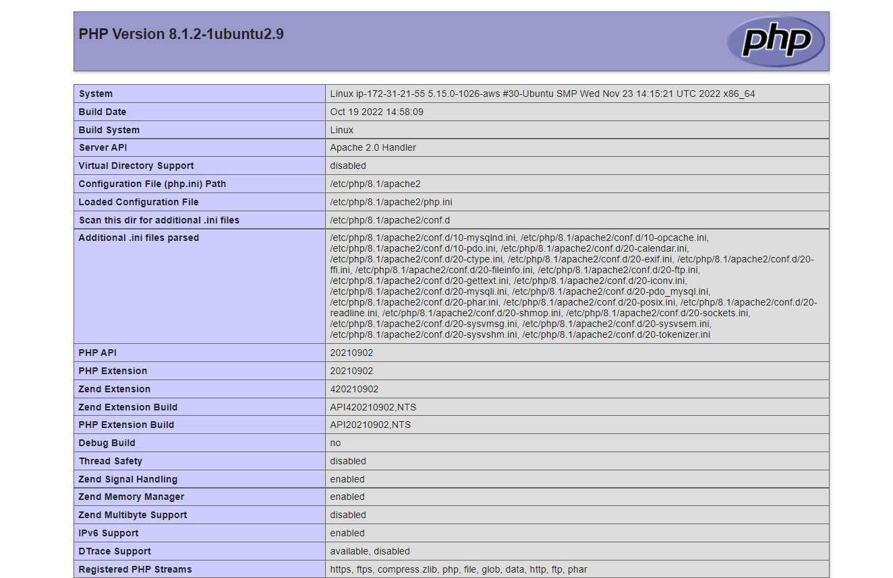
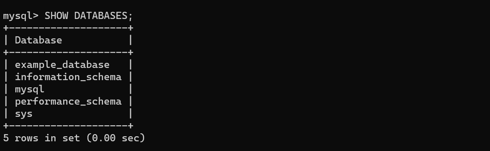
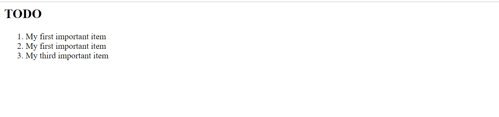

#  Implementation of LEMP (Linux-Nginx-MySQL-PHP) webstack on AWS

### Steps

1. Create a Security group for the EC2 instance defining desired inbound rules from target IPs
     
2. Launched EC2 instance, selecting an Ubuntu free tier
3. Made necessary configurations (Enabling Public IP, Assigning security group created in 2, creating key)-value pair) needed to run the EC2 instance.
    
4. SSH-ed into the EC2 instance using the windows terminal
    - Downloaded the Windows SSH from the windows store
    - Followed steps in [ARTICLE](https://learn.microsoft.com/en-us/windows-server/administration/openssh/openssh_install_firstuse?source=recommendations&tabs=powershell) in installing and configuring OpenSSH in windows.
    - The openSSH allows remote access into our EC2 instance from the windows terminal.
    - Followed steps in [OpenSSH key management](https://learn.microsoft.com/en-us/windows-server/administration/openssh/openssh_keymanagement) to create key authentication management for OpenSSH in windows
    

## Installing Nginx web server

### Steps

1. `sudo apt update` -- Updating packages in the package manager

2. `sudo apt install nginx` -- Installing Nginx

3. `sudo systemctl status nginx` -- Verifying that Nginx is successfully installed and running.

    

    - Check to see if installed Nginx is accessible on Ubuntu server
    - To do so, run `curl -s http://169.254.169.254/latest/meta-data/public-ipv4` to get the IP address of the device
    - Entering [Checking Apache HTTP server response to requests from the internet](http://<Public-IP-Address>:80) replacing <Public-IP-Address> with the IP address gotten from above step presents a webpage rendered with the information below.
    - 
    

## Installing MySQL Database
With the Apache server up and running, there is a need to set up a MySQL database for storing and managing relational data for the dynamic website.

### Steps

1. `sudo apt install mysql-server` -- Installing MySQL server on the EC2 instance

2. `sudo mysql` -- To login into the MySQL console.

    Successful login into the MySQL console presents the content below in the terminal.

    
3. `ALTER USER 'root'@'localhost' IDENTIFIED WITH mysql_native_password BY 'PassWord.1';` -- Sets the database root user password to **PassWord.1** 

4. `sudo mysql_secure_installation` -- To set password policy for better database security.

## Installing PHP
With the Apache setup to serve content and MySQL setup for storing and managing data. There is a need for PhP to process code and display dynamic content to the end user.

### Steps

1. `sudo apt install php-fpm php-mysql` -- Instals **php-mysql**; a PhP module that allows PHP communicate with MySQL-based databases and **php-fpm** -- *PHP fastCGI process manager*; tells Nginx to pass PHP requests to an external software for processing.

2. `php -v` -- Confirms the version of php installed on machine by displaying console information shown below

    

## Configuring NGINX to use PHP processor
Similar to Apache's virtual host, Nginx allows creation of server blocks to encapsulate configuration details and host more than one domain on a single server.

Nginx has a server block by default that serves documents out of a directory at */var/www/html*. 

Here, we create a directory structure within */var/www* for our domain website, leaving */var/www/html* in place as the default directory to be served if a client request does not match any other sites

### Steps

1. `sudo mkdir /var/www/projectLEMP` -- Creating a root web directory for our domain

2. `sudo chown -R $USER:$USER /var/www/projectLEMP` -- Changes ownership of the directory created in **1** so that the current user assumes ownership

3. `sudo nano /etc/nginx/sites-available/projectLEMP` -- Creates and open a new configuration file in Apache's *sites-available*

    

4. `sudo ln -s /etc/nginx/sites-available/projectLEMP /etc/nginx/sites-enabled/` -- Activates configuration by linking to the config file from Nginx’s sites-enabled directory

5. `sudo nginx -t` -- Checks for syntax errors in configuration file

6. `sudo unlink /etc/nginx/sites-enabled/default` -- Disables the default Nginx host currently configured to listen on port 80

7. `sudo systemctl reload nginx` -- Reloading Nginx server to apply changes

8. The *projectLEMP* currently does not have content to render.
Run `sudo echo 'Hello LEMP from hostname' $(curl -s http://169.254.169.254/latest/meta-data/public-hostname) 'with public IP' $(curl -s http://169.254.169.254/latest/meta-data/public-ipv4) > /var/www/projectLEMP/index.html` to redirect message *HELLO LAMP from hostname - <hostname> with public IP <IP_Address>* to an index.html file created in **/var/www/projectLEMP/index.html**

To view content in browser, put in `http://<Public-IP-Address>:80` in address bar of your browser.

## Testing PHP with NGINX
With the LEMP stack setup, there's a need to test if Nginx can correctly hand .php files to our processor.

### Steps

1. `sudo nano /var/www/projectLEMP/info.php` -- Creating and a editing test php file in document root 

2. Testing the PHP website in the browser shows

    

3. `sudo rm /var/www/projectLEMP/info.php` -- Removing the *info.php* file due to sensitivity of information in there.

## Retrieving data from MySQL database with PHP
Creating a test database with simple To-do-list and configuring to Nginx website query the DB and display it contents. 

### Steps

1. `sudo mysql -p` -- Connecting to MySQL console using the root acount

2. `mysql> CREATE DATABASE `example_database`;` -- Creating a test database named *example_database*

3. `mysql> CREATE USER 'example_user'@'%' IDENTIFIED WITH mysql_native_password BY 'password';` -- Creates user named *example_user* using *mysql_native_password* as the default authentication method 

4. `mysql> GRANT ALL ON example_database.* TO 'example_user'@'%';` -- Granting all permissions to *example_user* on *example_database* 

5. `mysql -u example_user -p` -- Testing if the new user can log in to the MySQL console

6. `mysql> SHOW DATABASES;` -- Displays information about the database as seen below.

    

7. Creating a table named *todo_list* by running the following commands

    `CREATE TABLE example_database.todo_list (item_id INT AUTO_INCREMENT,content VARCHAR(255),content VARCHAR(255),PRIMARY KEY(item_id));`

8. Inserting few rows of content in the test table as shown below

    

9. `mysql> SELECT * FROM example_database.todo_list;` -- Confirming data was successfully saved to table as shown below.

    

10. Creating a PHP script that will connect to MySQL and query for database content. 

    - `vi /var/www/projectLEMP/todo_list.php` -- Creating a new PHP file in your custom web root directory using an editor

    - The following PHP script connects to the MySQL database, queries for the content of the todo_list table and displays the results in a list.

        

    - `http://<Public_domain_or_IP>/todo_list.php` -- Testing to access this page in a web browser