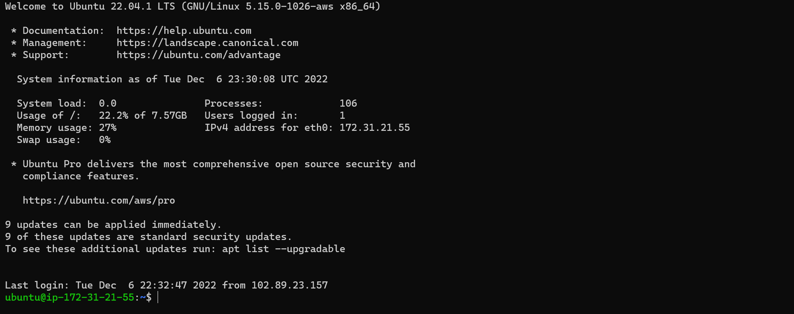
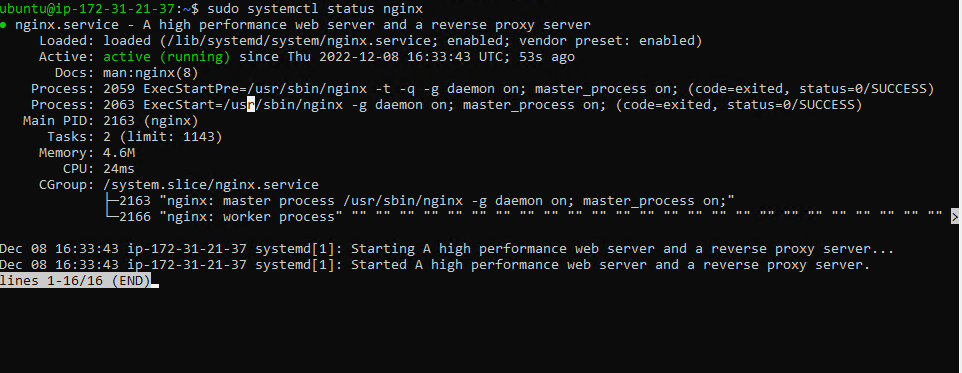

#  Implementation of LEMP (Linux-Nginx-MySQL-PHP) webstack on AWS

### Steps

1. Create a Security group for the EC2 instance defining desired inbound rules from target IPs
     
2. Launched EC2 instance, selecting an Ubuntu free tier
3. Made necessary configurations (Enabling Public IP, Assigning security group created in 2, creating key)-value pair) needed to run the EC2 instance.
    
4. SSH-ed into the EC2 instance using the windows terminal
    - Downloaded the Windows SSH from the windows store
    - Followed steps in [ARTICLE](https://learn.microsoft.com/en-us/windows-server/administration/openssh/openssh_install_firstuse?source=recommendations&tabs=powershell) in installing and configuring OpenSSH in windows.
    - The openSSH allows remote access into our EC2 instance from the windows terminal.
    - Followed steps in [OpenSSH key management](https://learn.microsoft.com/en-us/windows-server/administration/openssh/openssh_keymanagement) to create key authentication management for OpenSSH in windows
    

## Installing Nginx web server

### Steps

1. `sudo apt update` -- Updating packages in the package manager

2. `sudo apt install nginx` -- Installing Nginx

3. `sudo systemctl status nginx` -- Verifying that Nginx is successfully installed and running.

    

    - Check to see if installed Nginx is accessible on Ubuntu server
    - To do so, run `curl -s http://169.254.169.254/latest/meta-data/public-ipv4` to get the IP address of the device
    - Entering [Checking Apache HTTP server response to requests from the internet](http://<Public-IP-Address>:80) replacing <Public-IP-Address> with the IP address gotten from above step presents a webpage rendered with the information below.
    - 
    

## Installing MySQL Database
With the Apache server up and running, there is a need to set up a MySQL database for storing and managing relational data for the dynamic website.

### Steps

1. `sudo apt install mysql-server` -- Installing MySQL server on the EC2 instance

2. `sudo mysql` -- To login into the MySQL console.

    Successful login into the MySQL console presents the content below in the terminal.

    
3. `ALTER USER 'root'@'localhost' IDENTIFIED WITH mysql_native_password BY 'PassWord.1';` -- Sets the database root user password to **PassWord.1** 

4. `sudo mysql_secure_installation` -- To set password policy for better database security.

## Installing PHP
With the Apache setup to serve content and MySQL setup for storing and managing data. There is a need for PhP to process code and display dynamic content to the end user.

### Steps

1. `sudo apt install php-fpm php-mysql` -- Instals **php-mysql**; a PhP module that allows PHP communicate with MySQL-based databases and **php-fpm** -- *PHP fastCGI process manager*; tells Nginx to pass PHP requests to an external software for processing.

2. `php -v` -- Confirms the version of php installed on machine by displaying console information shown below

    

## Configuring NGINX to use PHP processor
Similar to Apache's virtual host, Nginx allows creation of server blocks to encapsulate configuration details and host more than one domain on a single server.

Nginx has a server block by default that serves documents out of a directory at */var/www/html*. 

Here, we create a directory structure within */var/www* for our domain website, leaving */var/www/html* in place as the default directory to be served if a client request does not match any other sites

### Steps

1. `sudo mkdir /var/www/projectLEMP` -- Creating a root web directory for our domain

2. `sudo chown -R $USER:$USER /var/www/projectLEMP` -- Changes ownership of the directory created in **1** so that the current user assumes ownership

3. `sudo nano /etc/nginx/sites-available/projectLEMP` -- Creates and open a new configuration file in Apache's *sites-available*

    

4. `sudo ln -s /etc/nginx/sites-available/projectLEMP /etc/nginx/sites-enabled/` -- Activates configuration by linking to the config file from Nginx’s sites-enabled directory

5. `sudo nginx -t` -- Checks for syntax errors in configuration file